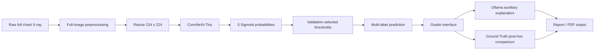

# Thoracic CXR Project 3

胸腔 X 光五類多標籤辨識與 RAD-DINO 特徵蒸餾系統

本專案是一個胸腔 X 光影像分類研究與展示系統。研究流程先在病灶 ROI 上進行 RAD-DINO 至 ConvNeXt-Tiny 的跨架構特徵蒸餾，再將 ROI Patch Proposed Backbone 遷移至完整胸腔 X 光五類多標籤模型。最終 Demo 直接接收完整胸腔 X 光影像，不需要使用者提供 BBox，並整合 Gradio、Ground Truth 比對、Ollama 輔助說明與報告／PDF 輸出。

本 README 只描述目前正式 project-3 研究線，不引用舊版專案或已停用專案內容。

## 1. 專案概述

本研究分成兩個相互銜接的階段。

### 階段一：ROI 單標籤知識蒸餾

ROI 階段依 Ground Truth BBox 製作病灶 ROI，建立五類單標籤分類任務。平衡後 ROI dataset 共 4,725 張，每類 945 張。此階段以 `microsoft/rad-dino` 作為 frozen Teacher，將 CLS feature 與 patch feature 蒸餾至 ConvNeXt-Tiny Student，並比較三種 ROI 模型：

- ImageNet Baseline
- RAD-DINO CLS Proposed
- RAD-DINO Patch Proposed

ROI 任務使用 Softmax 類型的單標籤分類設定。Patch Proposed 在部分類別具有競爭力，但正式 bootstrap 統計未支持其相對 baseline 的整體顯著優勢，因此本專案不將其解讀為全面性結論。

### 階段二：Full-image 多標籤模型

Full-image 階段使用完整胸腔 X 光影像，整張影像 resize 為 224 × 224，不使用 BBox crop 作為最終模型輸入。此階段為五類多標籤分類，模型輸出五個獨立 Sigmoid 機率，並使用 validation split 選出的 per-class thresholds 判定陽性類別。

Full-image 模型使用 ROI Patch Proposed Backbone 作為 transfer initialization，捨棄 ROI 單標籤 classifier head，重新建立五類多標籤 classifier head。正式描述為：

```text
ROI Patch Proposed transfer initialization -> Full-image multilabel fine-tuning
```

最終 Demo 使用 Full-image ConvNeXt-Tiny multilabel 模型，不使用 YOLO、BBox、ROI Crop 或 Softmax 單標籤流程。

## 2. 正式五類

本專案正式五類如下：

| Class ID | Class name |
|---:|---|
| 0 | Aortic enlargement |
| 1 | Cardiomegaly |
| 2 | Pleural thickening |
| 3 | Pulmonary fibrosis |
| 4 | Pleural effusion |

注意事項：

- 本專案沒有 No Finding 類別。
- Full-image 模型可同時輸出一個以上的陽性類別。
- 未超過 threshold 代表該類別未被判定為陽性，不代表模型輸出一個名為 No Finding 的類別。

## 3. ROI 與 Full-image 任務差異

| 比較項目 | ROI 階段 | Full-image 階段 |
|---|---|---|
| 輸入影像 | Ground Truth BBox 裁切後的 ROI | 完整胸腔 X 光影像 |
| 任務類型 | 五類單標籤分類 | 五類多標籤分類 |
| 輸出函數 | Softmax | Sigmoid |
| 是否使用 Ground Truth BBox | 是，用於建立 ROI crop | 否，最終模型不使用 BBox |
| 模型用途 | Teacher-student 蒸餾與 ROI 比較 | 最終完整影像推論與 Demo |
| 是否為最終 Demo | 否 | 是 |
| 是否可用於新完整影像 | 需先有 ROI/BBox，不作為最終 Demo 流程 | 可直接輸入完整影像 |

ROI 階段使用 BBox crop；最終 Demo 不使用 YOLO、BBox 或 ROI Crop。

## 4. 系統流程



流程界線：

- 模型負責影像分類。
- Ollama 不負責影像辨識，只依模型結構化結果產生保守輔助文字。
- Ground Truth 不輸入模型。
- Ground Truth 不傳給 Ollama。
- Ground Truth 只用於介面中的結果比對或研究驗證。

## 5. 資料與前處理

### ROI 資料

ROI 階段由 annotation BBox 對完整胸腔 X 光建立 ROI crop，再轉為 224 × 224 模型輸入。正式 ROI original corpus 為 4,546 rows；balanced ROI feature cache 使用 4,725 張 ROI，五類各 945 張。

Balanced ROI manifest 中包含 469 張由輸出檔案反向驗證到的 brightness augmented ROI。factor 實際值介於 0.95 至 1.05，但目前未找到可確認其產生抽樣公式的 generator，因此不可描述為特定隨機分布。Phase2 ROI split 中，brightness augmentation 僅進入 train split，val/test split 無 brightness augmentation。

RAD-DINO feature cache：

- CLS feature shape：`[4725, 768]`
- Patch feature shape：`[4725, 768, 7, 7]`

### Full-image 資料

Full-image 階段使用完整影像，正式 split 為 train 472、validation 59、test 59，共 590 張。完整影像前處理依正式 `training_config.json` 確認：

- source：complete raw/full chest X-ray
- convert mode：RGB
- resize：224 × 224
- tensor shape：`[3, 224, 224]`
- interpolation：BILINEAR
- antialias：true
- normalization mean：`[0.485, 0.456, 0.406]`
- normalization std：`[0.229, 0.224, 0.225]`
- augmentation：false
- bbox：false
- center crop：false
- random resized crop：false
- roi crop：false

Full-image dataset integrity audit 顯示 train/val/test 之間 image_id leakage 為 0，SHA256 leakage 為 0。

## 6. 模型架構與知識轉移

本研究使用 RAD-DINO 作為 Teacher 或 feature cache 來源，並將特徵蒸餾至 ConvNeXt-Tiny。RAD-DINO 不是最終 Demo 的推論模型。

ROI 階段包含：

- RAD-DINO CLS Teacher feature cache
- RAD-DINO Patch Teacher feature cache
- ConvNeXt-Tiny CLS Distillation
- ConvNeXt-Tiny Patch Distillation
- ROI Phase 2 five-class single-label fine-tuning

Full-image 階段使用 ROI Patch Proposed Backbone 進行 transfer initialization。正式初始化稽核顯示：

- 舊 ROI classifier head 被捨棄。
- 新 head 為 `Dropout(0.2) -> Linear(768,5)`。
- Full-image 階段不是重新載入 RAD-DINO teacher 進行完整影像蒸餾。
- Full-image loss 為 `BCEWithLogitsLoss`。
- optimizer 為 `AdamW`。
- backbone learning rate 為 `1e-05`。
- head learning rate 為 `0.0001`。
- batch size 為 `64`。
- AMP 為 `true`。
- epoch upper limit 為 `50`。
- early stopping patience 為 `10`。
- best checkpoint metric 為 Validation Macro-AUROC。

## 7. 正式實驗結果

### Full-image 多標籤模型

正式來源：`outputs/full_image_224_multilabel_seed42/phase2_patch_transfer/test_metrics.json`、`validation_selected_thresholds.json`、`dataset_integrity_audit.json`。

| 項目 | 數值 |
|---|---:|
| Full-image samples | 590 |
| Train / Validation / Test | 472 / 59 / 59 |
| Best epoch | 28 |
| Best Validation Macro-AUROC | 0.86420980 |
| Test Macro-AUROC | 0.7659989648033126 |
| Test Micro-AUROC | 0.7759740259740261 |
| Test Macro-F1 | 0.7865085676876251 |
| Test Micro-F1 | 0.7858942065491183 |
| Exact Subset Accuracy | 0.1694915254237288 |
| Hamming Loss | 0.288135593220339 |
| image_id leakage | 0 |
| SHA256 leakage | 0 |

Validation-selected thresholds：

| Class | Threshold |
|---|---:|
| Aortic enlargement | 0.50 |
| Cardiomegaly | 0.50 |
| Pleural thickening | 0.39 |
| Pulmonary fibrosis | 0.36 |
| Pleural effusion | 0.34 |

Threshold 來源為 validation split，test split 未用於選擇 threshold。

### ROI 三模型比較

正式來源：`outputs/raddino_convnext_tiny_three_model_comparison_seed42/tables/overall_metrics_comparison.csv` 與 bootstrap 統計檔。

| Model | Test Accuracy | Test Macro-F1 | Test Macro-AUROC |
|---|---:|---:|---:|
| ImageNet Baseline | 0.799559471366 | 0.807999579266 | 0.948420218737 |
| RAD-DINO CLS Proposed | 0.792951541850 | 0.801748192622 | 0.950664535571 |
| RAD-DINO Patch Proposed | 0.799559471366 | 0.805259370123 | 0.950580781191 |

ROI Accuracy 是單標籤分類 accuracy；Full-image Exact Subset Accuracy 是多標籤完整標籤向量完全一致比例，兩者不可直接視為同一種指標。Bootstrap 結果未支持主要模型差異達統計顯著。

## 8. Demo 功能

正式 Gradio Demo 主程式：`app_full_image_multilabel_ollama_gradio.py`。

已確認功能：

- 上傳完整胸腔 X 光影像。
- 執行 Full-image 五類多標籤推論。
- 顯示五類 Sigmoid 機率。
- 使用 validation-selected thresholds 判定陽性類別。
- 進行 Ground Truth post-hoc 比對。
- Ollama local LLM 依單張模型結果產生保守輔助說明。
- Ollama 不可用時 fallback 至規則式說明，分類結果保留。
- 輸出 session prediction、Ground Truth comparison、audit、Markdown 與 PDF 報告。
- 預設本機離線執行，`share=False`，不建立公開 Gradio link。

## 9. 專案結構

簡化目錄如下：

```text
.
├── app_full_image_multilabel_ollama_gradio.py  # 正式 Full-image multilabel Gradio Demo
├── AGENTS.md                                   # 專案工作規則與正式研究邊界
├── README.md                                   # 專案說明
├── requirements.txt                            # 目前列出的基礎依賴
├── run_project3_demo.ps1                       # project-3 Demo 啟動輔助腳本
├── full_image_outputs.txt                      # Full-image 輸出清單輔助文件
├── project_folders.txt                         # 專案資料夾清單輔助文件
├── config/                                     # 設定檔
├── data/                                       # 原始資料、處理資料與 split/manifest
├── docs/                                       # 論文、證據包、Demo 文件與封存資料
├── outputs/                                    # 正式 metrics、checkpoints、audit、reports 與 Demo outputs
├── scripts/                                    # 離線啟動與重啟批次檔
├── src/                                        # 資料處理、訓練、評估、推論與服務程式
└── tools/                                      # 輔助工具
```

大型影像、feature cache、checkpoint 與 session outputs 可能不適合放入一般 GitHub repository，請依 `.gitignore` 與資料治理規則管理。

## 10. 安裝方式

建議先建立 Python 虛擬環境，再安裝相依套件：

```powershell
python -m venv .venv
.\.venv\Scripts\Activate.ps1
pip install -r requirements.txt
```

目前 `requirements.txt` 僅列出部分基礎資料處理依賴，例如 `numpy`、`pillow`、`pydicom`。完整 Demo／訓練環境需依實際程式 import、環境稽核文件與本機 GPU/torch 設定建立。正式 Demo 已在 Gradio、PyTorch、torchvision、pandas、Pillow、numpy 等套件存在的環境中通過啟動前檢查。

Ollama 輔助說明預設使用本機 `gemma3:4b`。若 Ollama 無法使用，Demo 會降級為規則式說明，不影響模型分類。

## 11. 執行方式

以下只列出目前專案內實際存在的入口。執行前請確認資料、checkpoint、threshold 與環境皆已就緒；不要以 test set 選模型或 threshold。

### 資料稽核與 ROI 建置

```powershell
python src\data\collect_raw_images.py
python src\data\audit_image_bbox_pairs.py
python src\data\visualize_bbox_alignment.py
python src\data\crop_bbox_rois.py --margin-ratio 0
python src\data\audit_cropped_dataset.py
python src\data\create_roi_224_master_dataset.py
python src\data\finalize_roi_224_dataset.py
python src\data\prepare_model_inputs_224.py
```

### RAD-DINO Feature Cache

```powershell
python src\cache_raddino_teacher_features.py
python src\cache_raddino_teacher_patch_features.py
```

### ROI 模型實驗

```powershell
python src\train_convnext_tiny_phase1_distillation.py
python src\train_convnext_tiny_phase1_patch_distillation.py
python src\train_phase2_convnext_tiny_finetune.py
python src\compare_baseline_cls_patch.py
```

### Full-image 多標籤訓練與評估

```powershell
python src\prepare_full_image_224_multilabel_dataset.py
python src\train_full_image_224_multilabel_patch_transfer.py
```

若需要單張完整影像推論，可參考：

```powershell
python src\infer_full_image_224_multilabel_single.py
```

### Gradio Demo

離線一鍵啟動：

```powershell
scripts\start_demo_offline.bat
```

離線重啟：

```powershell
scripts\restart_demo_offline.bat
```

直接啟動主程式：

```powershell
python app_full_image_multilabel_ollama_gradio.py --project-root . --server-port 7860
```

啟動前檢查：

```powershell
python app_full_image_multilabel_ollama_gradio.py --project-root . --dry-run
python app_full_image_multilabel_ollama_gradio.py --project-root . --offline-smoke-test
```

若某些流程需額外參數，請以對應腳本的 `--help` 或 `docs/` 中的正式文件為準。

## 12. 大型檔案與 GitHub 說明

下列內容通常不適合放入一般 GitHub repository：

- Raw DICOM 或胸腔 X 光影像。
- ROI dataset。
- RAD-DINO feature cache。
- Checkpoint。
- NPZ／NPY。
- Demo sessions。
- 大量中間輸出。

GitHub repository 建議主要保存：

- 程式碼。
- 設定。
- 正式 metrics。
- audit。
- summary。
- 小型圖表。
- 論文文件。

請勿為了整理 repository 而刪除本機正式大型檔案。

## 13. 可重現性與資料安全

本專案的主要結果需追溯至正式 CSV、JSON、audit 與 metrics 檔案。整理或展示時請遵守：

- 不修改正式 checkpoint。
- 不修改 validation thresholds。
- 不使用 test set 選模型或 threshold。
- 不修改 Ground Truth。
- 不修改資料集 label、split、image_id 或 SHA256。
- 不造成 image_id 或 SHA256 leakage。
- 不將 Ground Truth 輸入模型或傳給 Ollama。
- 不將整批 metrics、confusion matrix 或訓練統計傳給 LLM。

## 14. 研究限制

- ROI 階段依賴 Ground Truth BBox，屬於 oracle ROI 設定。
- ROI 結果不能直接代表真實 Full-image 表現。
- Full-image 資料量有限，仍需更大規模資料驗證。
- 目前結果不可取代外部資料集驗證。
- Threshold 與 calibration 仍需更完整驗證。
- ROI 三模型比較為 single-seed 結果；bootstrap CI 未支持主要模型差異達統計顯著。
- Full-image 目前未建立正式 bootstrap 顯著性結論。
- 模型不可取代醫師診斷。

## 15. 醫療免責聲明

本專案僅供研究、教學與系統展示使用，不可取代放射科醫師判讀、臨床診斷、治療決策或正式醫療文件。若模型輸出顯示某些類別機率較高，仍需由合格醫療人員結合病史、症狀、理學檢查與正式影像判讀進行確認。
